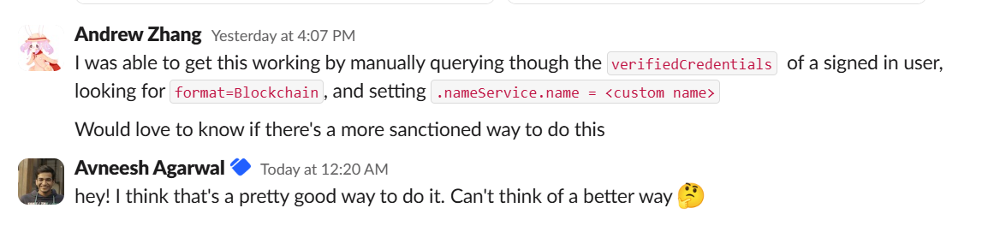

# Demo of HLNames integration with Dynamic
This is an example of how to integrate hlnames (or any name service) into Dynamic. The resulting behavior is that users that connect their wallet will see their PrimaryName (friendly .hl name) and avatar in the ConnectWallet button and Profile dialog.

Created with `npx create-dynamic-app`: https://www.dynamic.xyz/docs/example-apps

All relevant code is in `/src/lib/providers.tsx`. Everything else is boilerplate

## Setup
```
npm install
npm run dev
Go to localhost and connect your wallet
See your .hl name and avatar if it you've set it
```

Optionally change ENVIRONMENT_ID in `providers.tsx

## How it works

We hook into the `onAuthSuccess` callback, when triggers whenever a user signs in with dynamic (wallet or email sign in). We then loop through the user's [verifiedCredentials](https://www.dynamic.xyz/docs/users/verified-credential), looking for instances of `Blockchain`. We then pull out the address, query the [hlnames API](https://hyperliquid-names.gitbook.io/hyperliquid-names/dapp-integration/dapp-integration) for the user profile, and set the name and avatar on the credential's [nameServiceData](https://www.dynamic.xyz/docs/react-sdk/objects/verified-credential#nameservicedata)

This only applies to the local session, and does not affect the user object in the dynamic backend.

Confirmed with Dynamic support that this is likely the best way to do it: https://dynamiccustomers.slack.com/archives/C039EQEADS6/p1754329440318819



## Things i've tried that doesn't work
1. I initially tried to use the [Create a new name service for the environment and chain](https://www.dynamic.xyz/docs/api-reference/nameservices/create-a-new-name-service-for-the-environment-and-chain) API, however I was never able to get the signed message to work as it always returned 500 error.

2. I tried setting other fields on the [userProfile](https://www.dynamic.xyz/docs/react-sdk/objects/userprofile#userprofile), such as alias and firstName, but none of them shows up in the connectWallet. Per the code, only nameService and wallet address is used: 

## Resources
https://hyperliquid-names.gitbook.io/hyperliquid-names/dapp-integration/dapp-integration
https://www.dynamic.xyz/docs/introduction/welcome
https://app.slack.com/client/T039BRF4F7F
